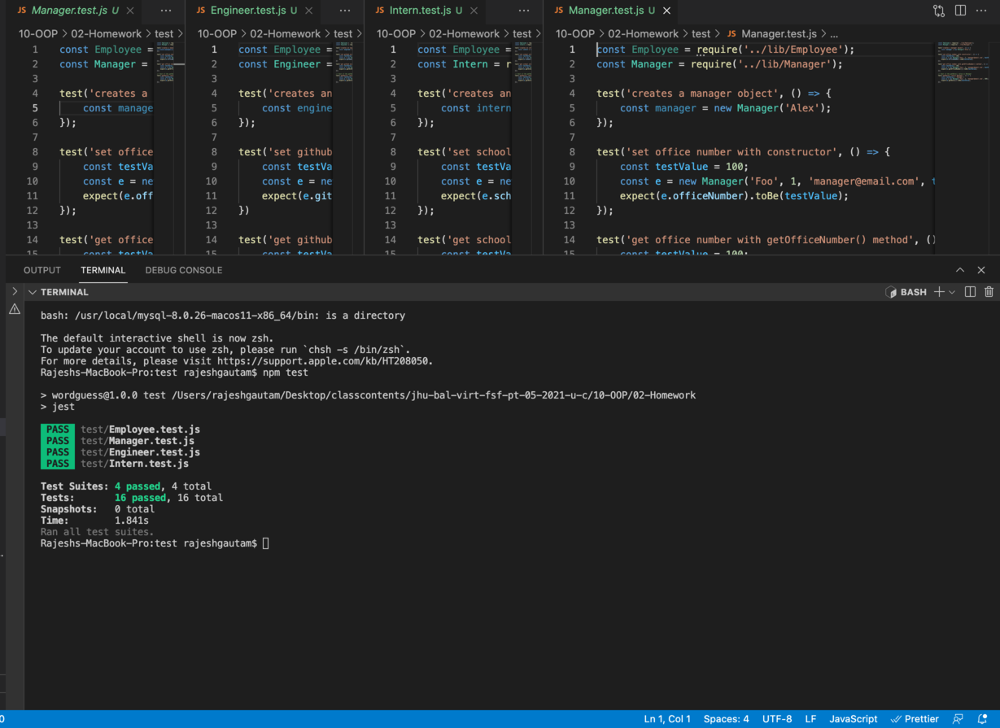
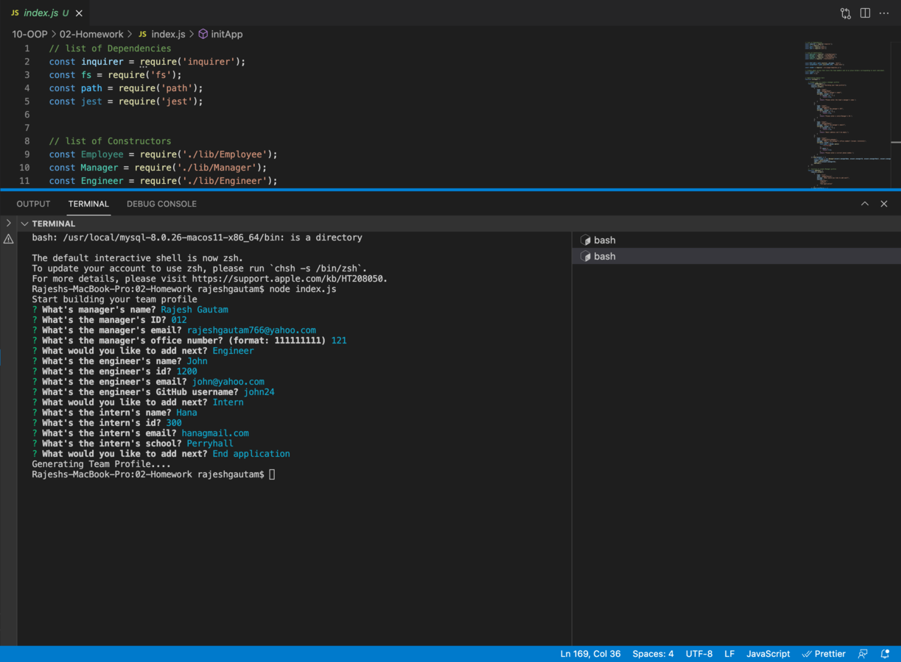
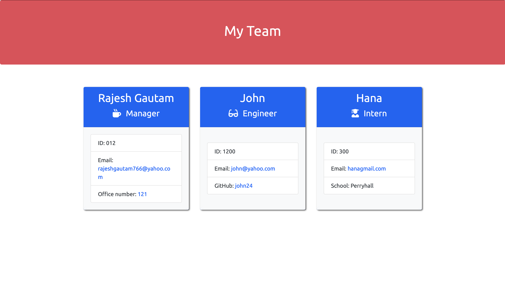

# Team Profile Generator

### Description
This is a node.js command line application which takes the prompt inputs and generates an HTML file. This application has builted up with an node.js and inquirer packages as a back end. This app will run in the browser and feature dynamically with updated [HTML](https://developer.mozilla.org/en-US/docs/Web/HTML), [CSS](https://developer.mozilla.org/en-US/docs/Web/CSS), [javascript](https://developer.mozilla.org/en-US/docs/Web/JavaScript), and [Node.js](https://nodejs.org/en/).
## Feature List:
- Node.js - Used for package managment and to execute JavaScript code to build command line tool for server-side scripting.

- Javascript - Used to base functionality of functions and prompts within the application.

The application will be invoked by typing the command:
node index.js. If any non-related input is given, it will notify the user. For a convenient and clear look, It has made the UI simple and attractive with appropriate css style and google fonts. 

## Usage
This application helps to generate the profile of the employee in a fast and convenient way for all the small and big organization. It will be very handy in those business where large number of new employee works and need to create profile constantly.

## Walkthrough video:

 [Click here for video](https://www.youtube.com/watch?v=PwxJADpobcs) 

## Screenshots
## Test 
 

## Prompted Results 
   

## Generated Team Profile
   
  

## Links :

* Link for the Github repository [Host by Github](https://github.com/Rajesh295-dev/Team-Profile-Generator)

## Contributor:

* [Rajesh Gautam](https://github.com/Rajesh295-dev)

- - -
 

